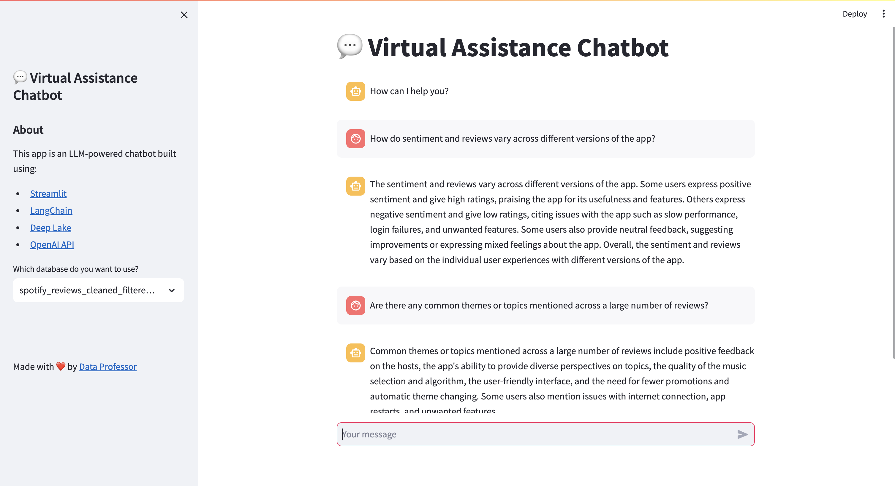

# Virtual Assistance for Product Review

<p align="center">
    
</p>

This project is a self-exploratory endeavor aimed at building a Chatbot utilizing [LangChain](https://www.langchain.com/), [OpenAI](https://openai.com/) services, and the [Deep Lake Vector Store](https://www.deeplake.ai/). The primary objective is to analyze Spotify application reviews sourced from a [Kaggle](https://www.kaggle.com/) dataset. The Chatbot, or virtual assistant, will employ the RAG (Retrieval-Augmented Generation) method to provide insightful and relevant responses to user inquiries related to the Spotify application.

## Dataset

This project is using the dataset from [Kaggle Dataset: 3.4 Million Spotify Google Store Reviews](https://www.kaggle.com/datasets/bwandowando/3-4-million-spotify-google-store-reviews/data). It contains text reviews, ratings, likes, and app_version that can be used for various application.

## Setup

### 1. Install Requirements

```
 # for exploring data with notebook and downloading dataset
pip install -r requirements.dev.txt

# for running streamlit app
pip install -r requirements.app.txt

```

### 2. Setup Environment Keys

Create a `.env` file and add the following keys

```
ACTIVELOOP_TOKEN=your_activeloop_token
OPENAI_API_KEY=your_openai_key
```

If you don't have the account, please register to the following websites:

- [OpenAI-API](https://platform.openai.com/docs/overview)
- [Activeloop Deep Lake](https://app.activeloop.ai/)

Sign in or register to [Kaggle](kaggle.com) and follow the instruction to setup the `kaggle.json` file.

## Preparation

### 1. Download Dataset

```
kaggle datasets download -d bwandowando/3-4-million-spotify-google-store-reviews
unzip 3-4-million-spotify-google-store-reviews.zip -d data/
# rm 3-4-million-spotify-google-store-reviews.zip
```

### 2. Prepare and Generate Vector Store

Because the dataset is large and it will need ~1 hour to process the entire dataset, it's better to prepare and store the data before using it.

Follow the instructions from `notebooks/data-exploration.ipynb` and `notebooks/sentence_generator.ipynb`.

- 'data-exploration' notebook will apply dataset preprocessing and reduce the number of dataset from 3.4M to just 1.1M using naive methods.
- 'sentence_generator' will generate the text files containing the predefined text and storing it in the vector database.

```
# from the root of `va-chatbot-review/`
jupyter lab
```

## Running the application

```
streamlit run app.py

# open localhost:8501 in browser
```

## Contribution

Contributions and feedback are welcome. Feel free to open issues, submit pull requests, or reach out for collaboration.

## License

This project is licensed under [MIT License](https://mit-license.org/) - see the [LICENSE](LICENSE) file for details.
